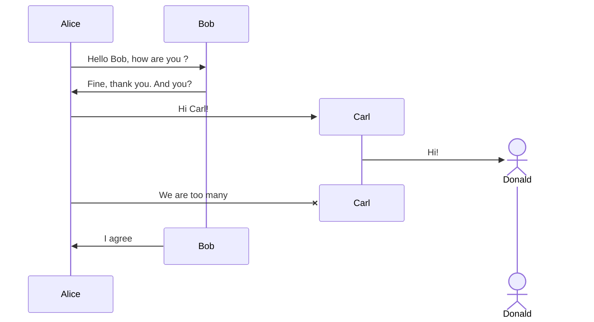
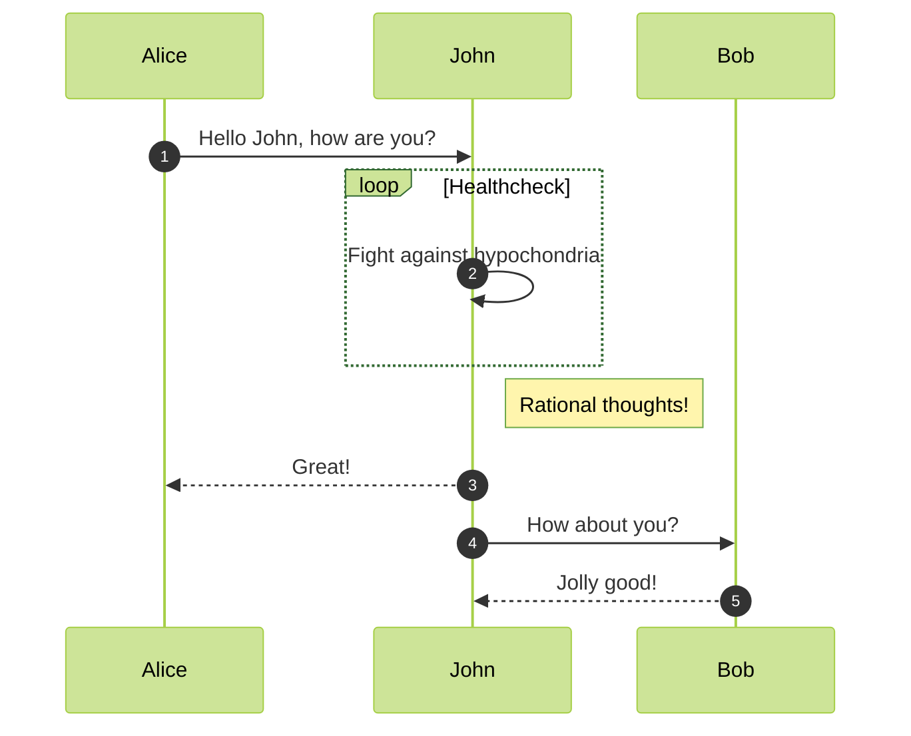

# 我的第一篇笔记

这是我的第一篇笔记，使用 Obsidian 进行创建。

## 链接其他笔记

你可以使用双向链接来链接其他笔记，比如 [[第二篇笔记]]。

## 使用标签

添加标签便于分类和搜索，比如 #知识管理。

## 列表

- 项目1
- 项目2
  - 子项目2.1
  - 子项目2.2

## 代码块

```python
print("Hello, Obsidian!")
```



